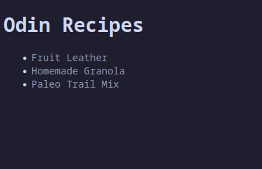

# Recipes
First project following the course of [The Odin Project](https://www.theodinproject.com), a simple recipe page as a practice of basic html and basic css.

## Live Demo:

[View Live Demo](https://jasmirmd.github.io/recipes/)

### Resources:
- [All Recipes](https://www.allrecipes.com/)
- [Catppuccin Palette](https://catppuccin.com/palette)
